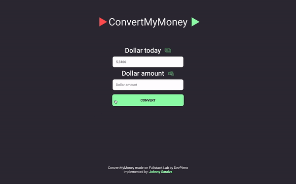

<h1 align="center">
    
</h1>

<h1 align="center">
   💰 ConvertMyMoney 💰
</h1>

<p align="center">


</p> 

<p align="center">
  <a href="#computer-about-the-project">About the Project</a>&nbsp;&nbsp;&nbsp;|&nbsp;&nbsp;&nbsp;
  <a href="#hammer-technologies">Technologies</a>&nbsp;&nbsp;&nbsp;|&nbsp;&nbsp;&nbsp;
  <a href="#rocket-getting-started">Getting Started</a>&nbsp;&nbsp;&nbsp;|&nbsp;&nbsp;&nbsp;
  <a href="#mailbox-contacts">Contacts</a>&nbsp;&nbsp;&nbsp;|&nbsp;&nbsp;&nbsp;  
  <a href="#memo-license">License</a>&nbsp;&nbsp;&nbsp;
</p>

<br>

<p align="center">
  
</p>

<br>

## :computer: About the Project 

💰 ConvertMyMoney 💰 A simple project with JavaScript that converts Dollars into Real.

## :hammer: Technologies

This project was built with:

-  [Node.js](https://nodejs.org/)
-  [Express](https://expressjs.com/pt-br/)
-  [EJS](https://www.npmjs.com/package/ejs)
-  [Date-fns](https://date-fns.org/docs/Getting-Started)
-  [Nodemon](https://nodemon.io/)
-  [Jest](https://jestjs.io/docs/en/getting-started.html)
-  [VS Code](https://code.visualstudio.com/)


## :rocket: Getting Started

**Clone or Download the Repository**

```bash
$ git clone https://github.com/Johnny-Saraiva/convert-my-money

# server 
$ cd convert-my-money

```

**Installing Dependencies**

```bash
# if you use yarn, run this:

$ yarn
```
or
```bash
# if you use npm, run this:

$ npm install
```
**Running the Project**

```bash
# Open the folder for start server
$ cd convert-my-money

# and if you use yarn, run this:

$ yarn dev
```
or
```bash
# if you want to use npm, run this:

$ npm run dev
```

## :mailbox: Contacts

Connect with me on [LinkedIn](https://www.linkedin.com/in/johnny-saraiva-701641164/).

## :memo: License

This project is under the MIT license. See the [LICENSE](LICENSE.md) for more information..

---

Made with ❤️ by Johnny Saraiva 👋 [Get in touch!](https://www.linkedin.com/in/johnny-saraiva-701641164/)